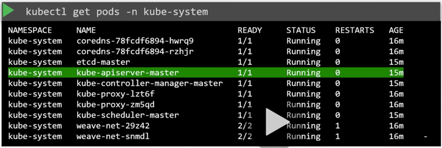
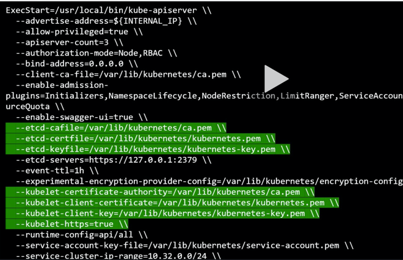
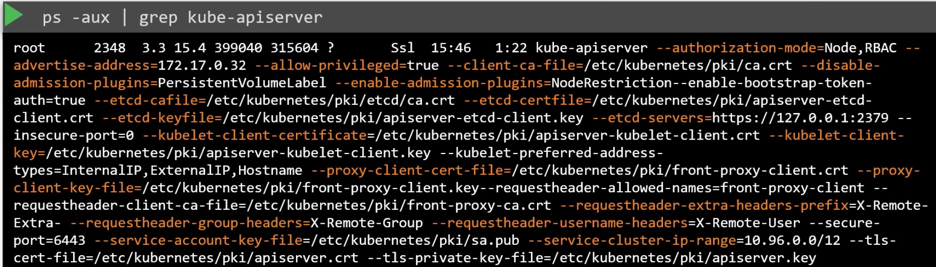

# API Server

Overview:

What it does:
* Authentcates and validates request. 
* talks to etcd cluster and responds back with information. 
* Talks to kubelet in case of any pod creation. 

Notes:
- Kubeadm deploys apiserver as a pod
- You can also send POST commands. 
- Scheduler monitors api server continuously for information. 

#### Kube api server options:
vim /etc/kubernetes/manifests/kube-apiserver.yml

#### Viewing kube-api-server process

[API Referece](https://kubernetes.io/docs/reference/kubernetes-api/)
