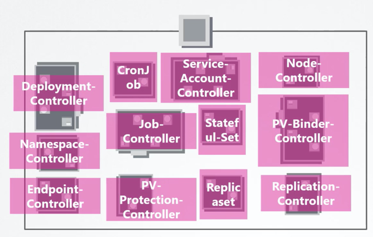
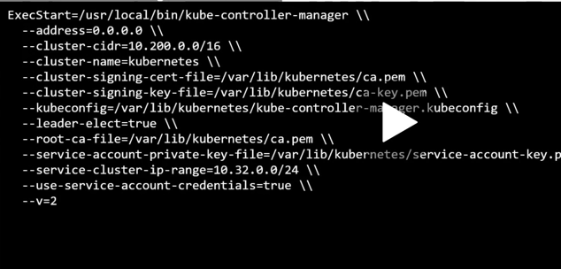
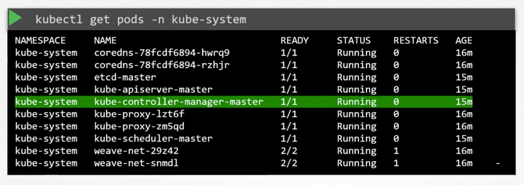
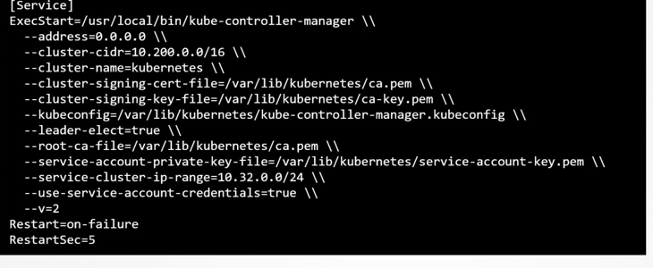

## What does a controller manager do

process that Continuously monitors the status of various components in the system
brings to the desired state

Different controllers:
- Node controller
- Replication controller

#### Node controller
- checks the status of the nodes every 5 seconds. 
- if stops responding, wiats for 40 seconds and marks the node as unreachable. 
- waits for 5 mins and then removes the pods and assigns them to a healthy node. 

#### Replication controller
- ensures the desired no. of pods are available at all times. 

Other controllers:
- Deployment Controller
- Namespace controller
- Endpoint controller
- Job controller
- Replicaset controller

