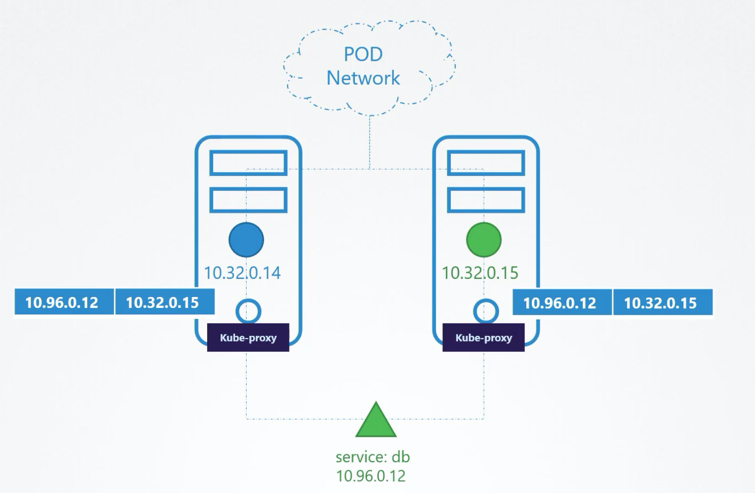
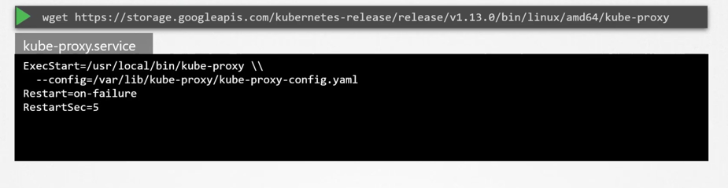
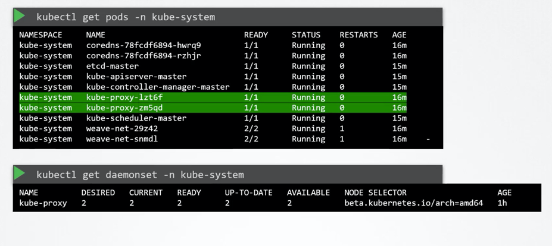

#### Basics:

- A pod can talk to another pod on a different node. 
- Pod network helps in communication. 

- Service helps in routing the traffic, it cannot join the pod network, does not have an interface, lives only in the memory. 

#### What does a kube-proxy do
- looks for new services
- creates the rules to forward the traffic to the appropriate pods. 
- creaets ip tables required for the communication (service to pod mapping)

#### Installing 

