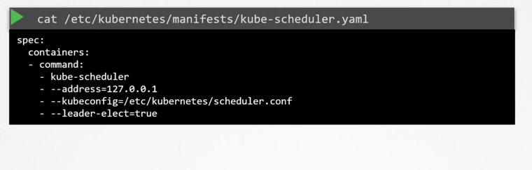
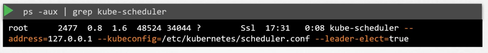

## 

#### what does a kubescheduler do. 

* decides which nodes should the pod go to. 
    - filter nodes that do not have sufficient memory and CPU
    - Ranks the node based on best fit for the node. 
        - calculates the amount of resources would be free after the pod is placed. 
        - whichever node has more resources will be picked. 

        
#### Installing kube-scheduler

1. download scheduler and install it as a kube-scheduler service
2. kubeadm: install them as a pod. 

View options:
cat /etc/kubernetes/manifests/kube-scheduler.yaml

View process:

