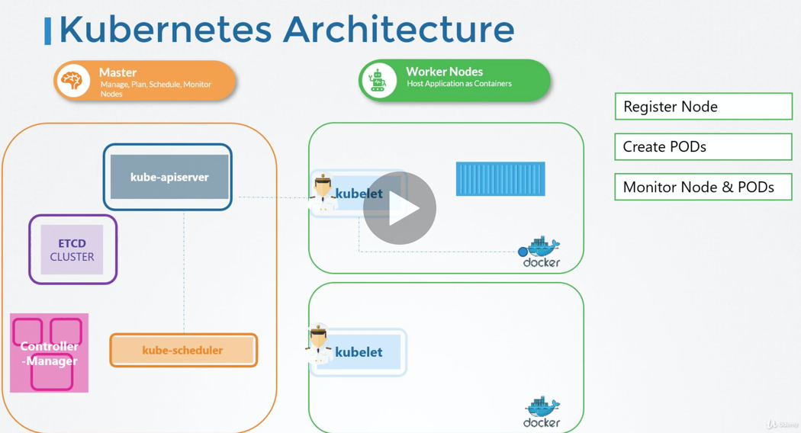
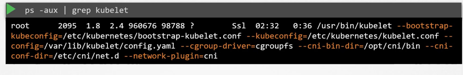

What does kubelet do
* registers the node with the k8s cluster. 
* requests the CR to pull image and deploy container. 
* reports health image to the kube api server

#### Installing kubelet. 

- kubeadm does not deploy kubelet, install manually.

#### View process

