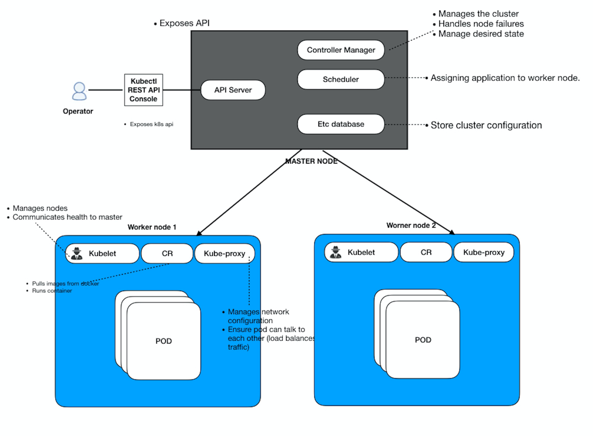

# Architecture

# Master nodes
- also known as control plane. 

### [etcd database](etcd/readme.md)
- key value database that stores information about the cluster. 

### Scheduler
- identifies the right node based on capacity/policies and assigns the pods to the nodes. 

### API Servers
- orchestrates all operations within the cluster. 
- exposes API to be consumed by different components. 
- external users can interact with the clusters. 
- worker nodes communicates with the API servers. 

### Controllers

- responsible for handling nodes 
- replicationcontroller - for handling no. of instances of apps. 

# Worker nodes
### Container Runtime
- software that retrieves images from runtime engines such as Docker. 
- has rockt, containerd, docker. 

### Kubelet Agent
- runs on each node, deploys and destroys the containers on the nodes. 
- reports health information to the master node. 

### Kube proxy service
- communication between pods of different nodes are done through kube-proxy
- manages the networking details for the communication. 

Note:
- CRI will also be in the master nodes. 
