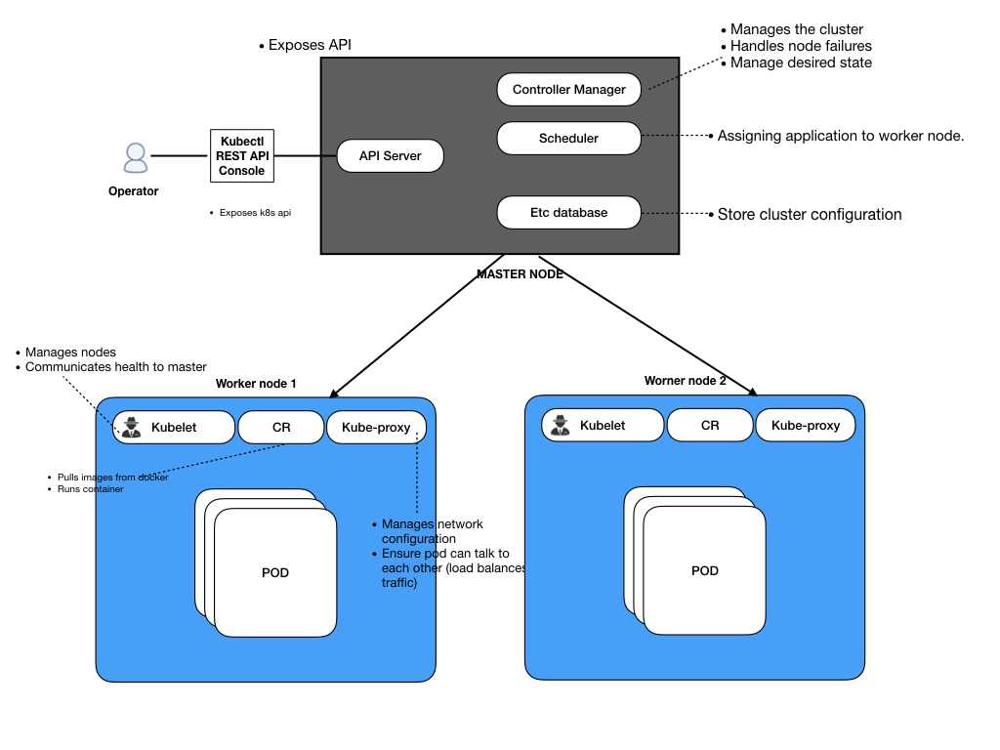

## Kubernetes

### Youtube reference 
[Youtube concepts & samples] https://www.youtube.com/watch?v=5OLbMOJMkLE&list=PLnwM5KTcJLKkeI-jl6qEOxKPUSTIQuQ1i&index=2&t=0s

### What is Kubernetes: 
Open source Container orchestration engine that helps in managing containerized apps, automated deployment and scaling. 

</img>
[Architecture](Architecture/overview.md)

### Kubernetes setup
[Setup in different cloud providers](setup/readme.md)

#### Sample programs
[Kubernetes objects - sample](samples/readme.md)

