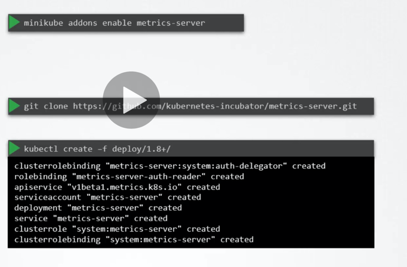

# 


## Metrics server

- in memory monitoring solution


How it works:
- Kubelet consists cAdvisor retrieves performance metris and exposes metrics api. 


```shell script
k top node
k top pod

```

Installing. 


