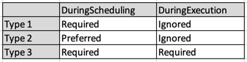

### Steps

```shell script
k get nodes --show-labels
k label nodes gke-apps-cluster-default-pool-662a0c23-k2h1 disktype=ssd
k apply -f pod-nginx-required-affinity.yml
k get pods -o wide
```

Note that the pod is placed in the node where the disktype is ssd. 

### Operators supported:
In, NotIn, Exists, DoesNotExist, Gt, Lt

### Node affinity types
States:
- DuringScheduling: pod does not exists and is created for the first time. 
- DuringExecution: pod is already present in the nodes, triggers mainly when the admin has changed the label in the node. 

Affinity:
- Required: if a matching node is not found, scheduler will not place the pod.
- Preferred: will try to enforce but not guaranteed, scheduler will try to place, but might place in a different node if the conditions are not met.




Discussion points:
- What if the node is not labelled as what is mentioned in the rules. 
