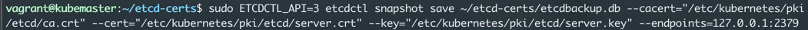
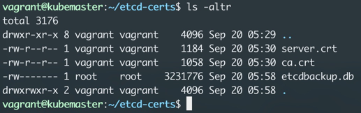
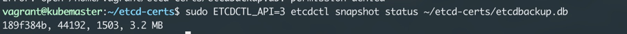
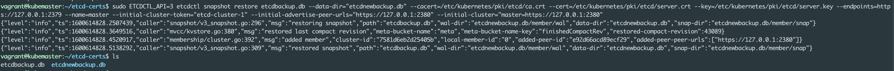

# ETCD

Install etcdctl if it does not exist

https://github.com/etcd-io/etcd/releases/

## Backup a ETCD cluster
- cacert of the kubernetes etcd
- server cert of the etcd server cert
- private key of etcd server key
- endpoints url
- location/file where you would want to backup the db. 

 



Check the status of the etcd backup


```shell script
# Backup command:
sudo ETCDCTL_API=3 etcdctl snapshot save ~/etcd-certs/etcdbackup.db \ 
    --cacert="/etc/kubernetes/pki/etcd/ca.crt" \ 
    --cert="/etc/kubernetes/pki/etcd/server.crt" \ 
    --key="/etc/kubernetes/pki/etcd/server.key" \ 
    --endpoints=127.0.0.1:2379
```

## Restoring a backup 


```shell script
#Restore command
sudo ETCDCTL_API=3 etcdctl snapshot restore etcdbackup.db \ 
    --data-dir="etcdnewbackup.db" \ 
    --cacert=/etc/kubernetes/pki/etcd/ca.crt \ 
    --cert=/etc/kubernetes/pki/etcd/server.crt \ 
    --key=/etc/kubernetes/pki/etcd/server.key \ 
    --endpoints=https://127.0.0.1:2379 \ 
    --name=master \ 
    --initial-cluster-token="etcd-cluster-1" \ 
    --initial-advertise-peer-urls="https://127.0.0.1:2380" \ 
    --initial-cluster="master=https://127.0.0.1:2380"
```

#### Items needed. 
