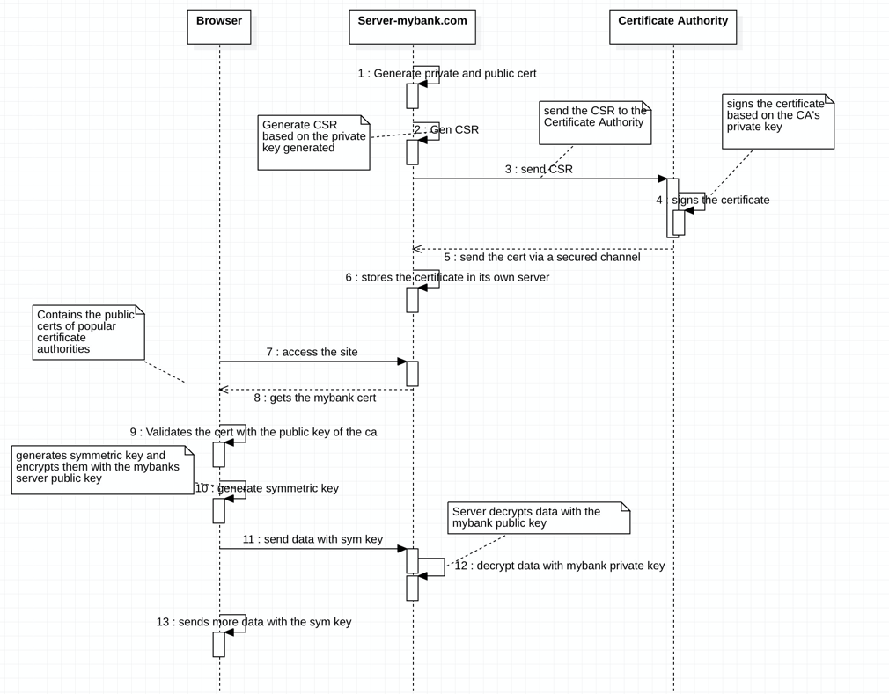

### How TLS works:

##### Server creates certificate
* Server A generates private and public key to secure HTTPS traffic. 
* Server A generates a CSR request based on the private key. 
* Server A sends the CSR to Certificate authority - CA
* The CA uses its private key to generate the certificate (sign the CSR)
* Signd CSR is sent to the the Server A

##### User access Server A
* User Sam uses his browser to hit the server A url
    * Browser gets the certificate from the Server A
    * Broker uses the CA’s public cert to validate the cert .
    * Once valid
        * Browser generates the symmetric key
        * Browser encrypts the symmetric key with the server public key. 
        * Sends the data along with the symmetric key. 
    * Server receives the data with the symmetric key
    * Serve decrypts the data with the server’s private key
    * Server reads the message

PKI: Public key infrastructure. 
