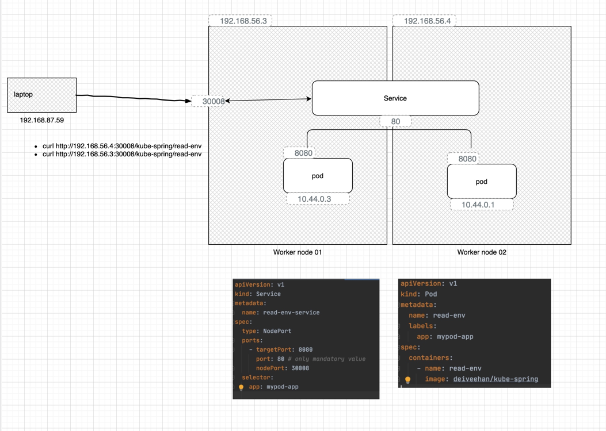

# Services


Types:
* NodePort
* Cluster IP
* 

## Pre-requisite: Setup
```shell script
git clone https://github.com/deiveehan/spring-with-kubernetes.git
./gradlew clean build
docker build --build-arg JAR_FILE=build/libs/\*.jar -t deiveehan/kube-spring .
docker push

kubectl apply -f kubernetes/pod.yml

```
## Directly curl the endpoint from within the master node. 
```shell script
#Master node ip: 192.168.56.2
#Laptop external ip address: 192.168.87.59
# pod ip address
k get pods -o wide
#10.44.0.1

#ssh into any of the node in the cluster
vagrant ssh kubemaster # I use my vagrant to provision the vms. 

# curl 
curl http://10.44.0.1:8080/kube-spring/read-env
# output: hello

```
## NodePort: callign from a local laptop



```shell script
kubectl apply -f kubernetes/service.yml
curl http://192.168.56.4:30008/kube-spring/read-env
curl http://192.168.56.2:30008/kube-spring/read-env
curl http://192.168.56.3:30008/kube-spring/read-env

# You should be able to hit the service from any node. 

```

## Using Load balancer
- On prem: 
    - You might need to create a proxy server and map the port 80 to the
     service. 
     - Map the dns name to the ipaddress 
- GCP:
    - Use LoadBalancer option. 
    - This ensures GCP creates the network load balancer and manage the port
     mappigns. 
    - It also provides an external IP address that can be used by the client. 
    
