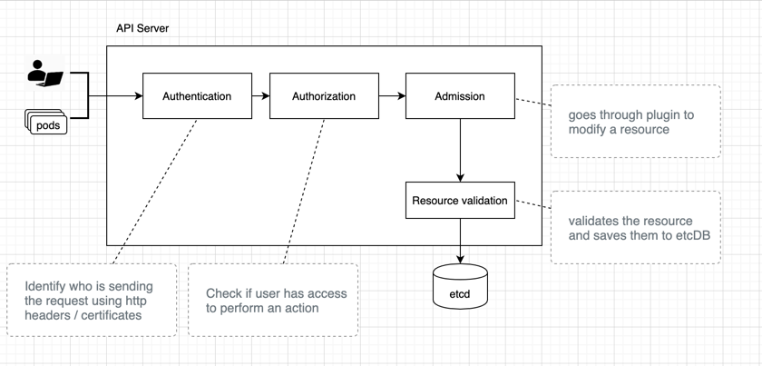

###

####Securing API Access:

API server can be called by 
- User through kubectl
- PODS

API server provides CRUD APIs that store state to the database. 



### Testing
k run test --image=dvn/kubectl-proxy -n my-ns


Create a new pod in a new namespace. 

```shell script
k run test --image=chadmcrowell/kubectl-proxy -n my-ns
kubectl exec -it test-659588d944-m6qfm -n my-ns sh
curl localhost:8001/ap/v1/namespaces/my-ns/services
```

Secured information about the user is stored in .kubeconfig in your local
.kube/config has the below information:
- master server address
- cert authority
- cluster info
- client cert and client key

```text
[ROLE] performs [ACTION] on a [RESOURCE]
ROLE:       <role-name> i.e., admin
ACTION:     CREATE, UPDATE, RETRIEVE, REMOVE
RESOURCE:   pod, services, namespace
```

Components:
### Role and Role binding (Name space resources)
ROLE: What can be done
ROLE-BINDING: Who can do it

### ClusterRole and ClusterRole Bindings (Cluster level resources)

### Request from Users

### Request from pods
- Pod is allocated service accounts to access other resources.

Example:
```shell script
k exec -it test-pod -n my-ns sh // ssh into the pod
curl localhost:8001/api/v1/namespaces/my-ns-services

cat /var/run/secrets/kubernetes.io/serviceaccount/token // service account can be found by sshing into the pod and issueing the following statement

k get serviceaccounts //display all service serviceaccounts

```

Note:
- a pod can only access service accounts in its namespaces.


