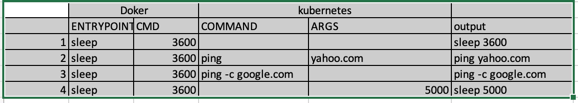

# Commands and arguments. 

## Pre-requisite
[Passing commands in Docker](https://github.com/deiveehan/xplore-docker/tree/master/samples/commands)
```shell script
# Ensure image exists in the docker hub. 
docker build -f 3-Dockerfile . -t deiveehan/docker-command
docker push deiveehan/docker-command
```

## Kubernetes arguments / Overriding Docker
### Overriding Docker [CMD] with Kubernetes [args]
```shell script
k apply -f 1-override-docker-args.yml
# You can ssh into the erspective node and check docker ps, the cmd value would
# be overridden with the arg value passed in the kubernetes

k get pods -o wide 
vagrant ssh kubenode01 #Verify which node that the pods rus.
sudo docker ps
```

### Overriding Docker [ENTRYPOINT] and Docker[CMD] with Kubernetes [command] and Kubernetes [ARGS]
```shell script
k apply -f 2-override-docker-entrypoint.yml
k logs pod/deivee-ub-sleeper
```

### Override combinations - sample chart


