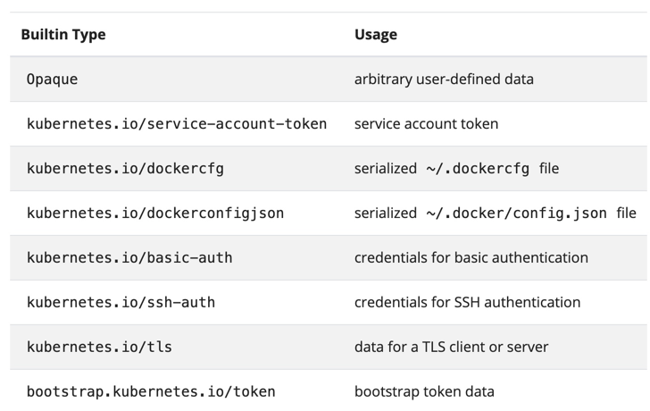

# Secrets
[Secrets Overview](https://kubernetes.io/docs/concepts/configuration/secret/?ref=hackernoon.com)

## 1. Creating secrets using Imperative commands
#### Create secret from a literal. 
```shell script
k create secret generic db-secret --from-literal=db-host=127.0.0.2 --from-literal=db-pass=test4#53a!
k get secret db-secret
k describe secret db-secret
k delete secret db-secret
```

#### Create secret from a file. 
```shell script
k create secret generic db-secret --from-file=1-db-secrets.out
k describe secret db-secret
k delete secret db-secret
```

## 2. Create secrets using a yaml file.

```shell script
#Create a password using base 64
echo "Deivee43$" | base64
# Create a secret using the yaml file.
k apply -f 1-secret-simple.yml
k describe secret db-secret
k get secret db-secret -o yaml
echo "RGVpdmVlNDMkCg==" | base64 --decode

```

## 3. Read secrets variables as environment variables.

```shell script
k apply -f 2-pod-read-all-secrets-as-vars.yml

k describe pod nginx
k logs pod/nginx
k delete pods/nginx
```

## 3. Read secrets variables as files in volumes

```shell script
k apply -f 3-pod-secret-volumes.yml
k exec -ti nginx -- /bin/bash

cd /etc/db-secret
cat db-pass
exit

k delete pods/nginx
```

## 4. Types of Secrets you can create



Syntax:
```shell script
k create secret generic db-secret --from-file=<yourhome>/.ssh/id_rsa

k create secret docker-registry NAME --docker-username=user
--docker-password=password --docker-email=email

kubectl create secret tls NAME --cert=path/to/cert/file --key=path/to/key/file

```


