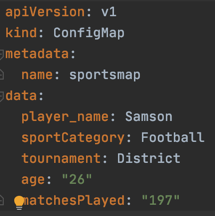
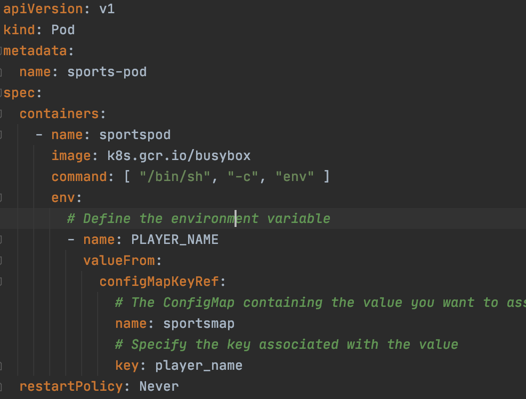
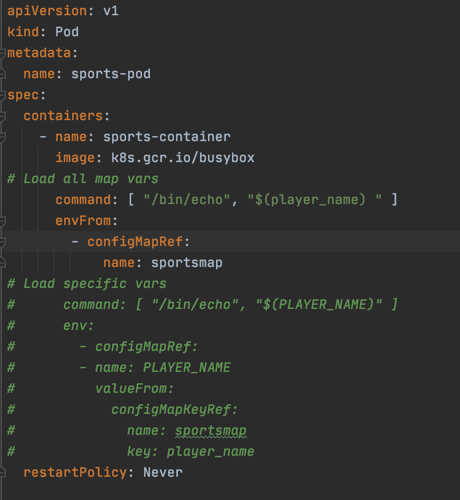

## ConfigMaps

[Configmaps Overview](https://kubernetes.io/docs/concepts/configuration/configmap/)

* Create config maps
    * Using imperative commands
    * Using YAML
* Use config maps
    * Inside a container using command and args
    * As an Env variables for a container
    * As a file in Read only volume
    * Read using the kubernetes API

### Create config map
# 1. Using imperative commands
Create a properties file


Create config map
```shell script
# Using literals
k create configmap sportsmap --from-literal=player_name=Samson --from-literal=sportCategory=Football
k describe cm sportsmap
k delete cm sportsmap

(OR)

#Using properties file
k create configmap sportsmap --from-file=cfmap.properties
k describe cm sportsmap
#Cleanup
k delete cm sportsmap
```

# 2. Using YAML
Create a config map configuration file.


```shell script
k apply -f cm-simple.yml
k describe cm sportsmap
```

### Using Config maps from the application

#### 1. As an Env variables for a container
Create pod: [sample](pod-using-env.yml)


```shell script
k apply -f pod-using-env.yml
k logs sports-pod
```

Another example:

```shell script
k apply -f pod-using-container-vars.yml
k logs pod/sports-pod
k delete pod/sport-spod
```
#### 2. As a file in Read only volume
```shell script
k apply -f pod-using-volumes.yml
k logs sports-pod
```

#### 3. Read using the kubernetes API
Use the kubernetes rest api from your application code to get the config maps. 


### Config maps as volume
```shell script
k apply -f config-map-pod-volume.yml
k logs test-configmap-pod-volume
kubectl exec test-configmap-pod-volume -- ls /etc/config
kubectl exec test-configmap-pod-volume -- cat /etc/config/empName
```

### Cleanup

