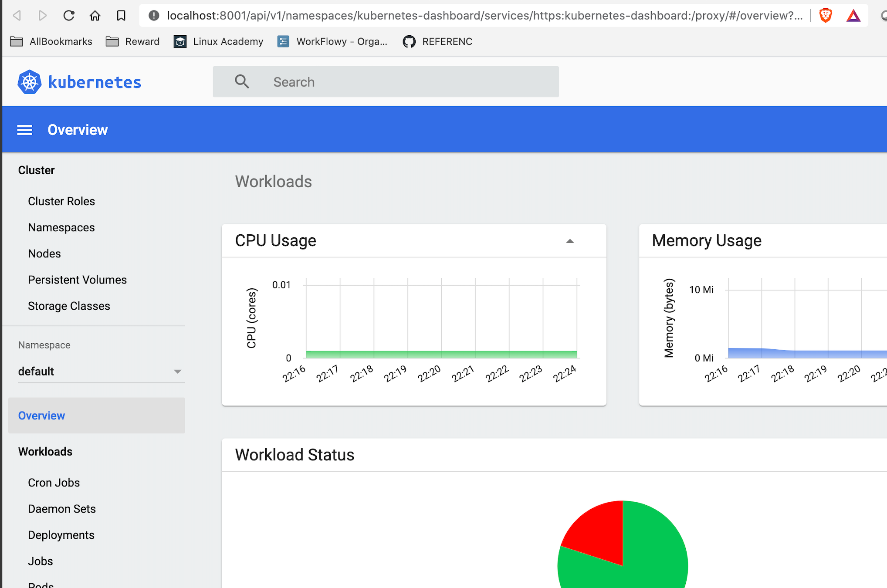

## Kubernetes dashboard
Explains how to install and access the kubernetes dashboard

</img>

#### Install kubernetes dashboard
```shell script
kubectl apply -f https://raw.githubusercontent.com/kubernetes/dashboard/v2.0.0/aio/deploy/recommended.yaml
kubectl proxy
```

#### Access the dashboard
```shell script
open http://localhost:8001/api/v1/namespaces/kubernetes-dashboard/services/https:kubernetes-dashboard:/proxy/
```

Get the token using the following command 
```shell script
gcloud config config-helper --format=json | jq .credential.access_token 
```

Paste the token in the browser and 
have fun with the dashboard !!

