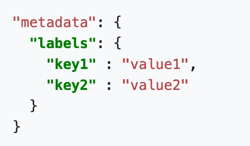
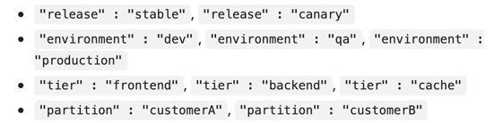
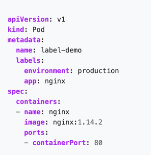
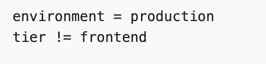
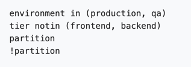

##Labels

Provides a way to add some information to your objects that can be used to filter them later. 

#### How it is used
- to search objects by filter (say all objects reltated to front end app)
- Assign resources to objects using label selectors

#### Syntax:


#### Examples:


#### Sample:


#### Create labels
[label-pod-basic.yml](label-pod-basic.yml)

#### View labels 
```shell script
k apply -f label-pod-basic.yml
k describe pod label-pod-basic
```

#### How to utilize labels
```shell script
k get pods -l app=label-pod-basic
k get pods -l env=dev
k get pods -l env=dev,app=label-pod-basic
k get pods -l 'environment in (production, qa)'

```


#### Label selectors

* Equivality / Inequality selectors



* Set based requirement



#### Using label selectors:

