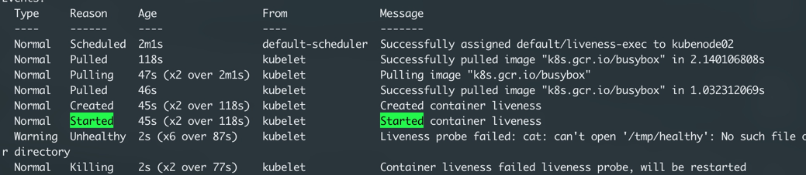
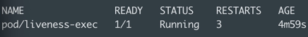

# Observability

Pod status:
- Pending
- ContainerCreating
- Running

Pod Conditions:
- PodScheduled
- Initialized
- ContainersReady
- Ready


## Liveness
- If the value is false, then kubernetes will attempt to restart the container. 

### Use cases:
- Catch a deadlock, restarting might be helpful. 

### Liveness - exec
```shell script
k apply -f liveness_exec.yml

# Check status
k describe pod/liveness-exec
# The pod will check for the file for the first 20 mins and it will exist
#. after that the file gets removed and the kubernetes will kill and restart
# as it reports unhealthy. 

```




### Liveness - http
```shell script
k apply -f liveness_http.yml

# Check status
k describe pod/liveness-http
# The pod will report healthy for the first 10 seconds and the /healthz
# endpoint will throw error. K8s will restart the container as the endpoints
# are throwing errors. 

```
### Liveness - tcp
```shell script
k apply -f liveness_tcp.yml

# Check status
k describe pod/goproxy
# The pod will report healthy for the first 10 seconds and the /healthz
# endpoint will throw error. K8s will restart the container as the endpoints
# are throwing errors. 

```

## Readiness
- If the value is false, 
### Usecases
- find out when a container is ready to start accepting traffic. 
- pod is ready when all of its containers are ready. 

### Readiness - exec (Sample)
```shell script
k apply -f liveness_exec.yml

# Check status
k describe pod/liveness-exec
# The pod will check for the file for the first 20 mins and it will exist
#. After that the pod ready status will be updated to NOT READY. the
# container will not be restarted.  
```

