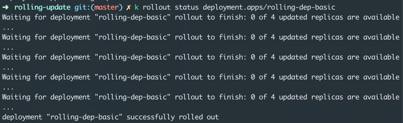
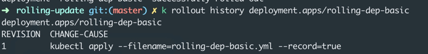

# Rolling updates
is a way for the developer to manage how he wants to deploy a new version of the application. 
- Deploy new version of the app using recreate/rollign update sttrategy. 
- rollback to the previous changes. 

Strategy:
* Recreate
    - Deletes all the pods and recreates all the pods at the same time. 
* Rollign update
    - Platform performs a rolling update whenever a new deployment is made. 

#### How to test the rolling update during the deployment
- k describe <pod> (Check the events)
- k get replicasets (Watch a new replicaset getting created and check the no. of available pods) 

#### Create a basic deployment
Create [Simple deployment](deployment-simplest.yml)
```shell script
k apply -f deployment-simplest.yml
k get deployments
k rollout status deployment/nginx-deployment
k rollout history deployment/nginx-deployment
```

You should be able to see multiple instances of pods based on the number you specified in the replicasets.

#### Edit the deployment directly
```shell script
k edit deployment nginx-deployment
```

change the replicaset to 1 and you will see the change immediately getting reflected. 
Kubernetes automatically manages the desired state based on the replicaset you specify

### Rolling update

Create a deployment with an image version, update the image version using rolling update version
```shell script
k apply -f rolling-dep-basic.yml --record
```
Check the rollign deployment status
```shell script
k rollout status deployment.apps/rolling-dep-basic
```

```shell script
k rollout history deployment.apps/rolling-dep-basic
```



If you want to undo the deployment.
```shell script
k rollout undo deployment.apps/rolling-dep-basic
```

