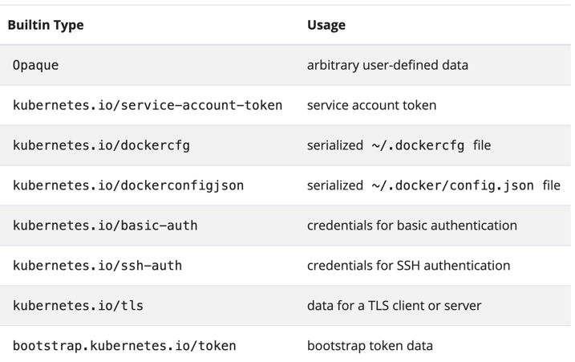

# Secrets
[Secrets Overview](https://kubernetes.io/docs/concepts/configuration/secret/?ref=hackernoon.com)

## Imperative commands

#### Create secret from a literal. 
```shell script
k create secret generic my-secret --from-literal=db-host=127.0.0.2 --from-literal=db-pass=test4#53a!
k describe secret my-secret
k delete secret my-secret
```

#### Create secret from a file. 
```shell script
k create secret generic my-secret --from-file=my-secrets.out
k describe secret my-secret
k delete secret my-secret
```
#### Create a secret using ssh private key
```shell script
k create secret generic my-secret --from-file=<yourhome>/.ssh/id_rsa
```

#### Create a secret for docker configuration
```shell script
  kubectl create secret docker-registry NAME --docker-username=user
--docker-password=password --docker-email=email
```

#### Creating a tls secret file. 
```shell script
kubectl create secret tls NAME --cert=path/to/cert/file --key=path/to/key/file
```

## Declarative approach
Type of Secret


