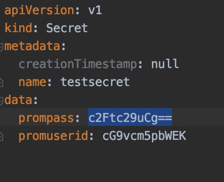
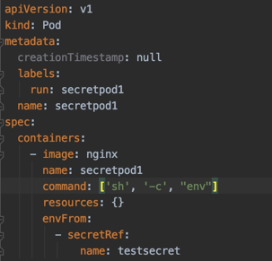
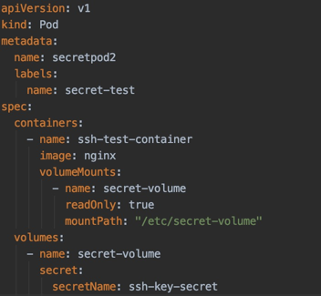
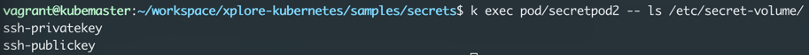

## Secrets

## Simple secret example

#### Convert from string to base64 before storing the credentials as plain text
```shell script
echo "samson" | base64
echo c2Ftc29uCg== | base64 --decode
```
#### Create a new secret (Basic string data)
[Secret sample] (secret1.yml)


#### Create pod that access the secrets



## Create a pod with SSH key
```shell script
kubectl create secret generic ssh-key-secret --from-file=ssh-privatekey="/home/vagrant/.ssh/id_rsa" --from-file=ssh-publickey="/home/vagrant/.ssh/id_rsa.pub"
```

#### Create a pod that mounts this secret


After applying this manifest yml, check the volume


