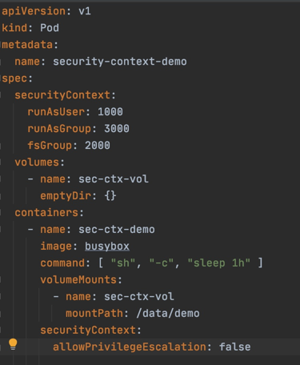
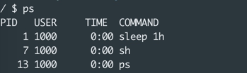
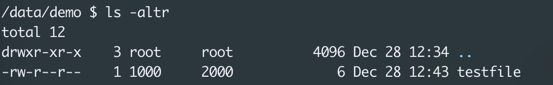
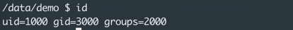

### Security context

#### Prerequisite
[Docker security basics](docker-security-basics.md)

#### Discussion points:
- If you configure security at the pod level, the same is applied to all containers in the pod. Settings on the container will override pod.
- Capabilities are supported at the container level, not the pod level.

#### Create a pod with a specific useraccess


```shell script
k apply -t pod-sec-context.yml
k exec -it secret-test-pod -- sh
```
list the process after sshing into the container


- the process runs with user 1000
```shell script
#create a test file
cd /data
ls -l

```

Group id is 2000

```shell script
# create a new file. 
cd demo
echo hello > testfile
ls -l
```





