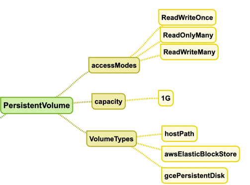

## PersistentVolumes

A Persistent volume is a shared pool of storage created by the administrator so that it can be used by the developers.
A persistent volume is claimed by a PersistentVolumeClaim request created by the developer.

Components in persistent volumes

Access modes in PersistentVolume
* ReadWriteOnce
* ReadWriteMany
* ReadOnlyMany

#### Create a persistentVolume
Reference: https://kubernetes.io/docs/concepts/storage/persistent-volumes/

