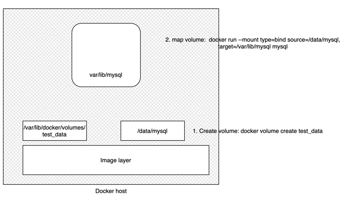

## Overview

### The problem:
The storage in the container is ephemeral (Pod is transient), which means that if you store anything in local file system, and the container stops, the content will not be available next time when the container starts. 

### How to resolve:
- Attach volume to the container. 
- volume lives outside the container in the host path. 
- When the pod dies or restarts, the volume is still available. 

### How it works in Docker
```shell script
docker volume create my-mysql-data
docker container run -dt --name mysql-container -v my-mysql-data:/etc mysql sh
docker ps
docker volume ls
docker volume inspect my-mysql-data

docker ps
docker exec -it 488d6a05e7ff sh

```

### How it works in kubernetes
```shell script

```


```shell script
docker volume create test_data
docker volume ls
docker volume inspect test_data
docker run --mount type=bind source=/data/mysql target=/var/lib/mysql mysql
```
[More info on bind mounts](https://docs.docker.com/storage/bind-mounts/)

Types:
[Volumes](volumes.md)
[Persistent Volumes](persistent-volumes.md)
- [PV/PVC Example](pvc-sample.md)

