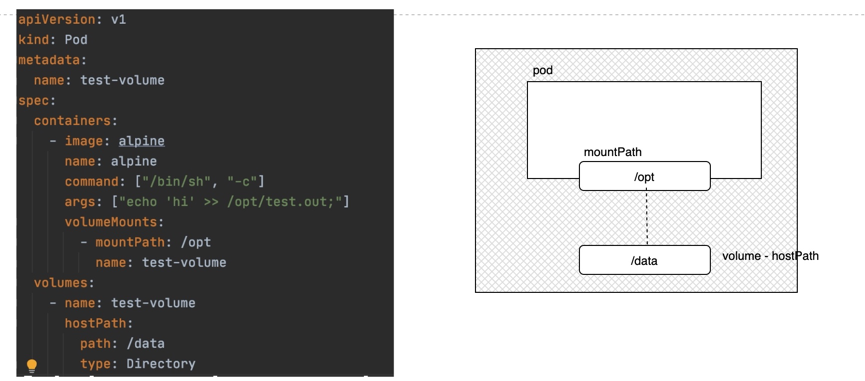

## Volumes

With volumes, the mountpath is defined at the container level which points to the hostPath in the host. 
The data stored by the container is actually stored on the host. 

### Sample kubernetes pod with a volume: 

#### Discuss:
- Problem of using hostPath option in multi-node cluster. 

### Storage options supported in kubernetes
* hostPath
* NFS, Flocker
* Public cloud providers
- AWS / EBS
- GCP (GCS)

